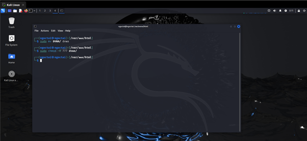

## BÁO CÁO QUÁ TRÌNH BUILD LOCAL LAB DVWA

*Chi tiết từng bước để cài đặt lab DVWA trên máy ảo Kali Linux cục bộ (không dùng Docker)*

---

### Bước 1: Thực hiện đọc tài liệu và cấu hình liên quan về mã nguồn DVWA trên github

Truy cập GitHub chính thức của DVWA:  
🔗 [https://github.com/digininja/DVWA](https://github.com/digininja/DVWA)

---

### Bước 2: Tải mã nguồn về máy

<div style="text-align: justify;">

- Trên máy ảo Kali Linux, di chuyển đến thư mục gốc của web server Apache */var/www/html/*, sau đó thực hiện git clone mã nguồn DVWA từ Github về máy, bằng các câu lệnh như sau:
</div>

```bash
cd /var/www/html
sudo git clone https://github.com/digininja/DVWA.git
```

---

### Bước 3: Đổi tên và cấp quyền

<div style="text-align: justify;">

- Sau khi git clone thành công mã nguồn DVWA, sẽ xuất hiện một thư mục là *DVWA/*, thực hiện đổi tên thư mục thành *dvwa/* (để tiện khi gõ lệnh), cùng với đó cấp toàn quyền (full permission) cho thư mục *dvwa/* để có thể đọc, ghi, thực thi thư mục này:
</div>

```bash
sudo mv DVWA dvwa
sudo chmod -R 777 dvwa
```

---

### Bước 4: Cấu hình file cấu hình

<div style="text-align: justify;">

- Di chuyển đến thư mục config trong thư mục *dvwa/*, ta có thể thấy file mẫu *config.inc.php.dist* chứa cấu hình mặc định do tác giả DVWA cung cấp. Tuy nhiên, đây không phải là file được hệ thống DVWA sử dụng trực tiếp:
</div>

```bash
cd dvwa/config
```

- Ta sẽ thấy file mẫu `config.inc.php.dist`:


---

### Bước 5: Tạo file config thật

<div style="text-align: justify;">

- Thực hiện sao chép và đổi tên thành *config.inc.php* để sử dụng làm file cấu hình thực tế, vì khi lab DVWA khởi động, nó chỉ đọc file *config.inc.php* để lấy thông tin kết nối CSDL, cấu hình bảo mật, captcha,... Nếu không có file này, DVWA sẽ báo lỗi hoặc không hoạt động được. Trong thư mục */var/www/html/DVWA/config*, gõ lệnh:
</div>

```bash
cp config.inc.php.dist config.inc.php
```

---

### Bước 6: Tạo cơ sở dữ liệu cho lab DVWA

<div style="text-align: justify;">

- Do ta đang sử dụng MariaDB chứ không phải MySQL (MariaDB là mặc định trong Kali), nên không thể sử dụng root user của database, cần phải tạo người dùng database mới. Để thực hiện việc này, hãy kết nối với database với tư cách là root user, sau đó sử dụng các lệnh sau:
</div>

```sql
CREATE DATABASE dvwa; // Tạo database riêng tên dvwa 
CREATE USER 'admin'@'127.0.0.1' IDENTIFIED BY 'password'; // Tạo user admin với password là password
GRANT ALL ON dvwa.* TO 'admin'@'127.0.0.1'; // Cấp toàn quyền truy cập DB cho user này
FLUSH PRIVILEGES; // Cập nhật lại các quyền
```


---

### Bước 7: Cập nhật cấu hình kết nối database

<div style="text-align: justify;">

- Thực hiện cập nhập file cấu hình *config.inc.php* bằng câu lệnh sudo nano */var/www/html/DVWA/config/config.inc.php*, sau đó sửa các biến *db_user* và *db_password*  đúng với user và password đã tạo ở Bước 6:
</div>

```bash
sudo nano /var/www/html/dvwa/config/config.inc.php
```


- Sửa các dòng:

```php
$_DVWA[ 'db_user' ] = 'admin';
$_DVWA[ 'db_password' ] = 'password';
```

- Tùy chỉnh biến *default_security_level* để đặt mức bảo mật thành mức phù hợp với thử nghiệm muốn thực hiện:
```php
$_DVWA[ 'default_security_level' ] = 'low';
```

---

## Bước 8 (Tuỳ chọn): Bật include URL

<div style="text-align: justify;">

- Trong thư mục */etc/php/8.2/apache2*, thực hiện mở file php.ini và sửa giá trị hai biến *allow_url_include* và *allow_url_fopen* là On, để bật khả năng tải và thực thi file PHP từ các URL bên ngoài:
</div>

```bash
sudo nano /etc/php/8.2/apache2/php.ini
```

```ini
allow_url_include = On
allow_url_fopen = On
```


---

## Bước 9: Thực hiện start/restart lại apache2 

```bash
sudo systemctl restart/start apache2
```

---

## Bước 10: Truy cập DVWA

<div style="text-align: justify;">

- Mở trình duyệt Firefox và truy cập: http://127.0.0.1/dvwa/ giao diện ban đầu sẽ xuất hiện, tiếp đó kéo xuống dưới và click chọn nút "Create/Reset Database". Sau đó, thực hiện login vào DVWA với user và password đã cấu hình trước đó.
</div>

```
http://127.0.0.1/dvwa/
```


---

## ✅ Kết luận:

Bạn đã cài đặt thành công DVWA local trên Kali Linux mà không dùng Docker. DVWA đã sẵn sàng cho các bài lab kiểm thử bảo mật web.

---

